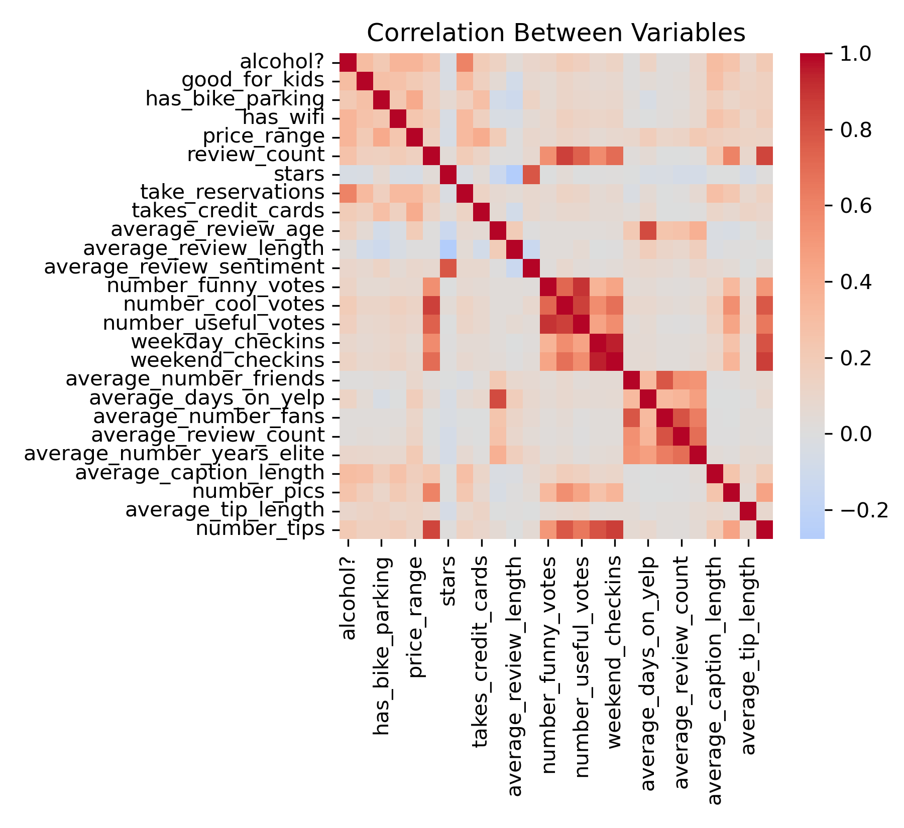
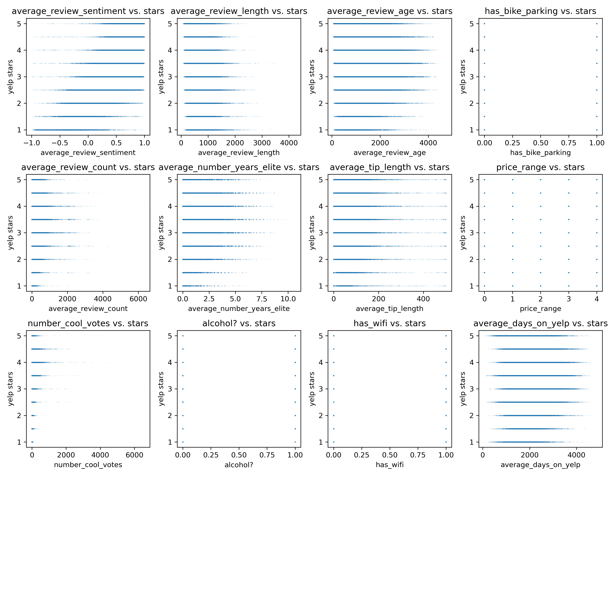
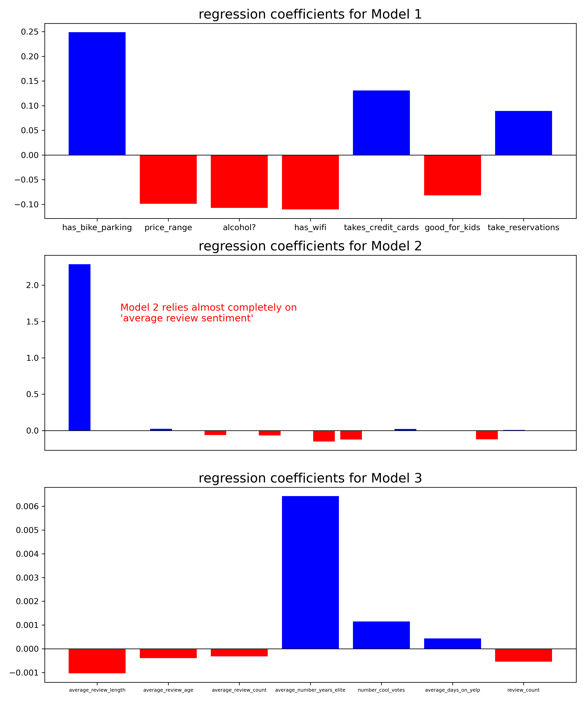
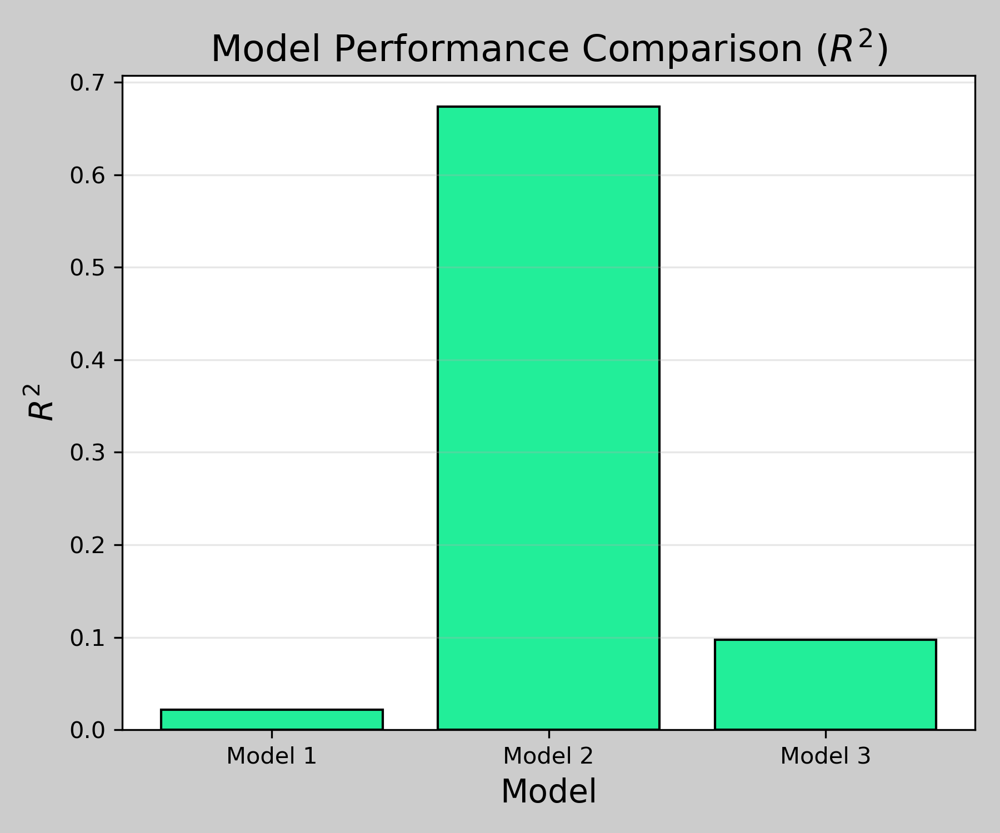

# Advising Restaurants on How to Improve Customer Reviews Using Multiple Linear Regression on Yelp Review Data

This project analyzes a subset of the [Yelp Open Dataset](https://www.yelp.com/dataset), provided by codecademy for educational use. 

## Objectives

- Explore distributions of review data and correlations between variables
- Select variables for multiple linear regression models
- Create and train 3 distinct models including: (1) controllable amenities, (2) all correlated variables and (3) user engagement variables
- Evaluate and compare chosen models
- generate actionable insights for improving yelp reviews

## Skills Demonstrated

- Data cleaning and preparation
- Feature Selection
- Multiple linear regression
- Model evaluation
- data-driven recommendations

## Key Results

- review stars trivially correlate with average review sentiment
- Model 1 (controllable amenities) demonstrated little predictive power with an $R^2$ score of about 0.02
- Model 2 (all correlated variables) demonstrated higher predictive power with an $R^2$ score of about 0.68, but was dominated by the "average review sentiment" variable
- Model 3 (customer engagement variables) demonstrated more predictive power than model 1 with an $R^2$ score of about 0.1

## Selected Visualizations

**Correlations between variables:**

**Exploratory analysis between relevant variables and average star rating using scatterplots:**

**Comparison between regression coefficients of all three regression models:**

**Bar plot of $R^2$ score for all three models:**

## Restaurant Recommendations

- provide basic amenities (bike parking, child-friendlyness, credit-card payments) despite low predictive power to remove barriers for positive reviews
- develop marketing efforts (loyalty programs, events, advertizements) to increase customer buzz and engagement (engagement shown to have moderate predictive power)
- focus on intangibles not included in the available dataset (quality of service, restaurant atmosphere, food quality), that would naturally effect reviews

